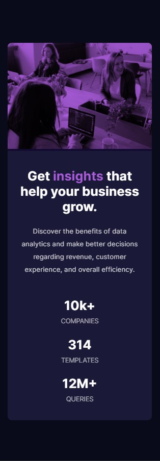

# Frontend Mentor - Stats preview card component solution

This is a solution to the [Stats preview card component challenge on Frontend Mentor](https://www.frontendmentor.io/challenges/stats-preview-card-component-8JqbgoU62). Frontend Mentor challenges help you improve your coding skills by building realistic projects. 

## Table of contents

- [Overview](#overview)
  - [The challenge](#the-challenge)
  - [Screenshot](#screenshot)
  - [Links](#links)
- [My process](#my-process)
  - [Built with](#built-with)
  - [What I learned](#what-i-learned)
  - [Continued development](#continued-development)
  - [Useful resources](#useful-resources)
- [Author](#author)

## Overview

### The challenge

To make a stats preview card that is fully responsive.

Users should be able to:

- View the optimal layout depending on their device's screen size

### Screenshot

Desktop version:

Mobile version:

### Links

- Solution URL: [Add solution URL here](https://www.frontendmentor.io/solutions/stats-preview-card-component-main-rEFNR8ZGO)
- Live Site URL: [Github Pages](https://timmartin13-frontend-mentor.github.io/stats-preview-card-component-main/)

## My process

My process was to start with the mobile layout first and the add a media query to handle the transition to desktop.  I started with getting the image to display correctly, then I just worked down the page, getting each section to display the way the design showed.  Once the mobile layout was finished, I started the same flow on the desktop version.

### Built with

- Semantic HTML5 markup
- CSS custom properties
- Flexbox
- Mobile-first workflow

### What I learned

I learned that mobile first development works really well and Flexbox is a very powerful tool.  

### Continued development

Since this was my first exercise on the Fronend Mentor site, I went with CSS and HTML to keep things easy.  In the future, I plan on implementing React.js and Sass to work on those skills.

### Useful resources

- [Flexbox](https://css-tricks.com/snippets/css/a-guide-to-flexbox/) - This is the best resource that I have found for Flexbox, it has everything you need in a very nicely presented way.

## Author

- Website - [Tim Martin Portfolio](https://timmartin13.github.io/react-portfolio/)
- Frontend Mentor - [@TimMartin13](https://www.frontendmentor.io/profile/TimMartin13)

